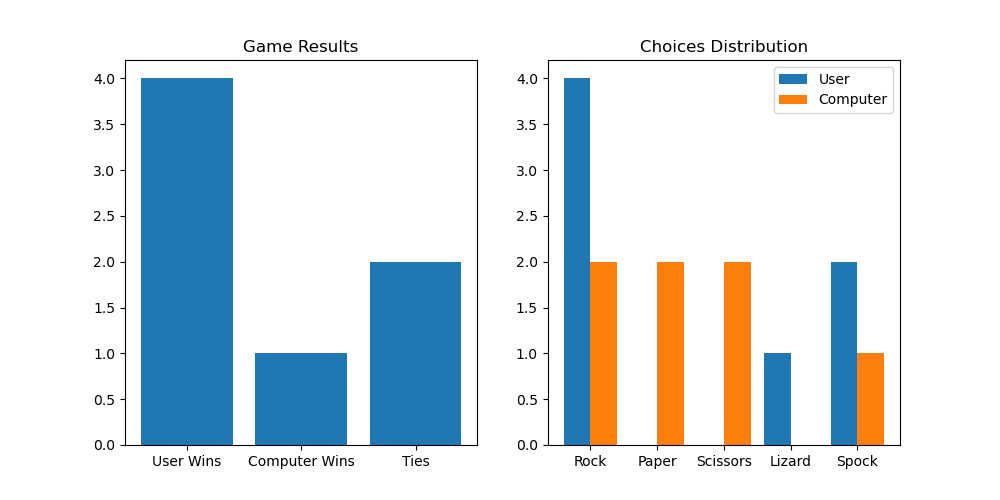

# Notas

## Prompts para resolver el ejercicio

<details>
<summary>Prompts para resolver el ejecicio</summary>

- prompt describir someramente el juego

  ```yml
  quiero crear el juego de piedra papel o tijera con dos elementos mas lizard y spock. piedra pierde ante spock, papel gana a spock, tijera gana a lizard y lizard gana a papel... el juego será en la terminal $ Choose your option:

  - Rock
  - Paper
  - Scissors
  - Lizard
  - Spock
  ```

- prompt crear test de covertura

  ```yml
  @workspace /tests Implement unit tests using pytest or any testing module of your choice. Try to aim for 100% coverage
  ```

- Me pide habilitar algo

  ```yml
  @workspace /tests Accept: "Configure Test Framework"
  ```

- prompt insisto en la creación de test

  ```yml
  implementa ahora los test
  ```

- prompt crear una api

  ```yml
  Adding a REST API Turn it into a REST API E.g. sending a POST /rock (or json payload) should return a 200 OK response with the result in the body
  ```

  - Para ejecutar un ejemplo de la api del juego

  ```yml
    curl -X POST -H "Content-Type: application/json" -d '{"choice": 1}' http://127.0.0.1:5000/play
  ```

  ```yml
    curl -X POST -H "Content-Type: application/json" -d '{"choice": 2}' http://127.0.0.1:5000/play
  ```

  ```yml
    curl -X POST -H "Content-Type: application/json" -d '{"choice": 3}' http://127.0.0.1:5000/play
  ```

  ```yml
    curl -X POST -H "Content-Type: application/json" -d '{"choice": 4}' http://127.0.0.1:5000/play
  ```

  ```yml
    curl -X POST -H "Content-Type: application/json" -d '{"choice": 5}' http://127.0.0.1:5000/play
  ```

  - la salida se vería algo así:

    ```json
    {
      "computer_choice": "Scissors", 
      "result": "You win!", 
      "user_choice": "Rock"
    }
    ```

- prompt extra, para crear módulo de estadísticas

  ```yml
  puedes hacer un módulo que vaya almacenado las estadísticas de cuantas veces gana cada uno y que opciones han salido más, ya sea jugando desde consola o desde la api, y muestras una gráfica el resultado
  ```

- Para ejecutar un ejemplo de la api del juego

  ```yml
  curl http://127.0.0.1:5000/stats
  ```  

  - mostrará una salida como esta

    ```json
    {
      "computer_wins": 2, 
      "image": "stats.png", 
      "ties": 3, 
      "user_wins": 5
    }
    ```

  - y podrás ver la imagen que ha generado en este caso sería esta 

- prompt extra para tener entorno

  ```yml
  quiero crear un entorno para instalar las dependencias
  ```  

</details>

## Generar un fichero requirements.txt

<details>
<summary>Generar fichero requirements</summary>

- Guardar las dependencias en un archivo requirements.txt:

- Ejecuta el siguiente comando para guardar las dependencias instaladas en un archivo requirements.txt:

  ```yml
  pip freeze > requirements.txt
  ```  

- El archivo requirements.txt debería verse algo así:

  ```ini
  click==8.0.1
  Flask==2.0.1
  itsdangerous==2.0.1
  Jinja2==3.0.1
  MarkupSafe==2.0.1
  matplotlib==3.4.2
  numpy==1.21.0
  Pillow==8.2.0
  pyparsing==2.4.7
  python-dateutil==2.8.1
  six==1.16.0
  Werkzeug==2.0.1
  ```

- Ahora, cualquier persona que quiera replicar tu entorno puede hacerlo siguiendo estos pasos:
  - Clonar el repositorio o copiar los archivos del proyecto.

  ```yml
  git clone https://github.com/copilot-workshops/copilot-rock-paper-scissors
  ```
  
  - Crear y activar un entorno virtual.

    ```yml
    python3 -m venv venv
    ```

    - activar el entorno en Windows

      ```yml
      source venv/Scripts/activate
      ```

    - activar el entorno en Windows

      ```yml
      .\venv\Scripts\activate
      ```

  - Instalar las dependencias desde el archivo requirements.txt:

  ```yml
  pip install -r requirements.txt
  ```  

- Esto asegurará que todas las dependencias necesarias estén instaladas en el entorno virtual

</details>
